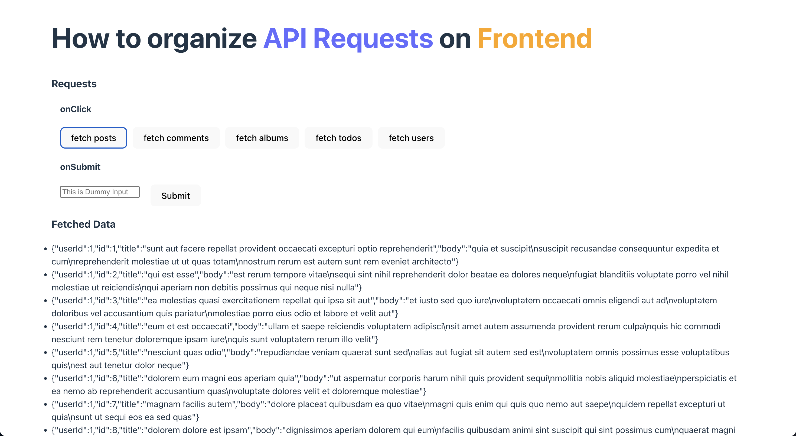

# 프론트엔드에서 API 요청을 관리하는 방법



## Contents

1. <a href='#preview'>Preview</a>

2. <a href="#1-axios-소개">Axios 소개</a>

   1. <a href="#11-간단한-기능">간단한 기능</a>
   2. <a href="#12-유용한-기능">유용한 기능</a>

      1. <a href="#121-커스텀-인스턴스-생성">커스텀 인스턴스 생성</a>
      2. <a href="#122-전역으로-기본값-정의">전역으로 기본값 정의</a>
      3. <a href="#123-인터셉터">인터셉터</a>

3. <a href="#2-프론트에서-api요청-관리하기">프론트에서 API요청 관리하기</a>

## Settings

```bash
## install dependencies
   yarn

## start dev server
   yarn dev ## vite let you know dev server URL on terminal

## build and preview
   yarn build
   yarn preview ## vite let you know dev server URL on terminal
```

## Preview

> 해당 프로젝트에서는 실무 과정에서 마주한 API 요청 및 관리 이슈에 대한 고민 및 개선 과정을 공유합니다.

모던 프론트엔드에서는 Ajax 기술을 기반으로 한 동적 API 요청이 너무나 흔한 것이 되었다.
그런 이유로, 서비스가 고도화됨에 따라 사용해야하는 API는 빠르게 늘어난다.
만약 서비스의 많은 API를 체계적으로 관리하지 않는다면 어떤 실제 API를 사용하는지 파악하기 어려울 뿐더러,
API에 변경이 생길 때 수고로운 수정을 해야 할 것이다.
최악은 미쳐 변경을 하지 못한 구현에서 에러가 발생하는 경우다.

때문에 API 요청은 체계를 잡고 관리할 필요가 있다. 이는 많은 이점을 가져온다.

- API 요청과 관련된 서비스 공통 사항을 적용하기 용이함
- 프론트엔드 개발자가 클라이언트에서 실제 사용하는 API를 파악하기 편함
- 항목별로 나누어 관리하기 용이함
- API 변경 사항 발생 시 빠르고 안전하게 대응할 수 있음

## 1. Axios 소개

axios는 클라이언트(브라우저)에서 XMLHttpRequests를 기반으로 간편한 ajax 비동기 요청 및 응답을 도와주는 fetch 라이브러리이다.
나는 대부분의 프로젝트에서 axios를 쓸 만큼 애용하는데, ajax를 위해 axios를 선택한 이유는 다음과 같다.

1. 간편하고 강력하다.
   axios는 브라우저에서 기본적으로 제공되는 fetch API와 유사하지만, 조금 더 개발자 친화적이다. axios 자체의 메서드 설계가 잘 되어있어 다양한 http method, body등을 직관적으로 설정할 수 있다.

   ```javascript
   const body = { ... };

   fetch("https://my-mock-api-server", {
     method: "POST",
     body: body,
   });

   axios.post("https://my-mock-api-server", body);
   ```

2. 다양한 내장 기능을 사용할 수 있다.
   내가 자주 사용하는 axios의 내장 기능은 크게 두 가지이다.

   - Axios 인스턴스

     ```js
     const instance = axios.create({
       baseURL: "https://my-mock-api-server",
       withCredentials: true,
       headers: { Authorization: "some auth token" },
     });
     ```

     axios.create메서드를 이용하면 커스텀 인스턴스를 정의할 수 있다. 커스텀 메서드를 사용하면, 도메인별 설정을 분리하여 관리할 수 있다. 예를 들어, 클라이언트에서 사용하는 API서버가 다수일 때, 요청 인스턴스를 분리하여 각 도메인에 맞는 설정을 기본으로 하여 사용한다. 요청 마다 설정을 매번 하지 않아도 되고, 변경 사항 일괄 적용 및 디버깅에 있어 정말 편리하다.

   - interceptors
     인터셉터는 요청 및 응답이 완료 되기 전 가로채어 전 처리를 하는 기능이다. 오류 처리, 인증 토큰 재발급 등 활용도가 무궁무진한 axios의 강력한 기능이다.

     ```js
     axios.interceptors.request.use((config) => {
       configs.headers.Authorization = accessToken;
       return config;
     });

     axios.interceptors.response.use(
       (response) => response,
       (error) => {
         if (error.response?.status !== 401) {
           return Promise.reject(error);
         }
         const { accessToken, refreshToken } = requestRefreshToken(response);

         error.response.accessToken = accessToken;
         error.response.refreshToken = refreshToken;
         axios(error);
       }
     );
     ```

     위 코드처럼 모든 axios 요청 전 헤더에 인증 토큰을 담는 것과 401 인증 오류 발생 시 토큰을 재발급 받고 다시 요청하는 과정을 간편하게 구현할 수 있다.
     즉, interceptor는 axios 통신에서 미들웨어로서 기능을 하기때문에 복잡한 통신 처리를 할 때 유용하다.

3. 가장 인기 많은 HTTP-client 라이브러리이다.
   npm 다운로드 동향을 파악할 수 있는 <a href="https://npmtrends.com/axios-vs-got-vs-request-vs-superagent">npm trends</a>에 의하면 axios는 브라우저 HTTP-client 라이브러리에서 단연 1위다.
   

더 자세한 사항은 <a href="https://axios-http.com/kr/docs/intro">Axios 공식문서</a>를 참조하길 바란다.

## 2. 프론트에서 API요청 관리하기

1. 다수의 domain API 관리하기
   1. 반복되는 줄이기
      1. 추상화
      2. 확장
2. 이벤트 관리하기
   1. 어떻게 하면 fetch 로직을 이벤트와 관계 없이 재사용하기 좋게 관리할 수 있을까?

## 3. msw 사용

1. 간단한 로그인 로직 구현

   1. 로그인
      로그인 버튼 클릭 시

      - session storage에 로그인 true 저장
      - random accessToken 발급하여 cookie에 담아 클라이언로 전송

   2. 로그아웃
      로그아웃 버튼 클릭 시

      - session storage에 로그인 false 저장
      - accessToken cookie 만료 클라이언로 전송

   3. 인증/인가
      인증 페이지 진입 or API호출
      - axios interceptor로 accessToken 헤더에 담아 보내기 Authorization
      - msw에서 요청 받을 때 헤더에 Authorization 없으면 401에러
